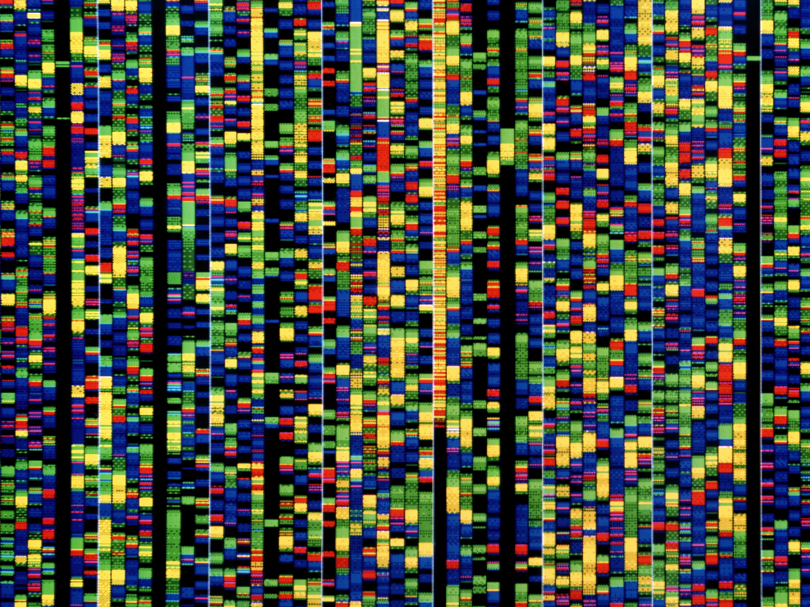

# QuanGene Tools

    

This repo contains generalizable quantitative genetics tools. Each directory contains code for a specific use case. Below is an overview of each:
* genetic_map 
  * genetic_map.py
    * Purpose: Runs pairwise comparisons between SNPs to calculate recombination frequencies. 
    * Input: XLSX file with the SNP data (SNPs as columns, Lines as rows, see example "BarleyChrom1.xlsx")
    * Output: CSV file containing recombination frequencies for each unique pair of SNPs (see example "recombination_frequency.csv")
